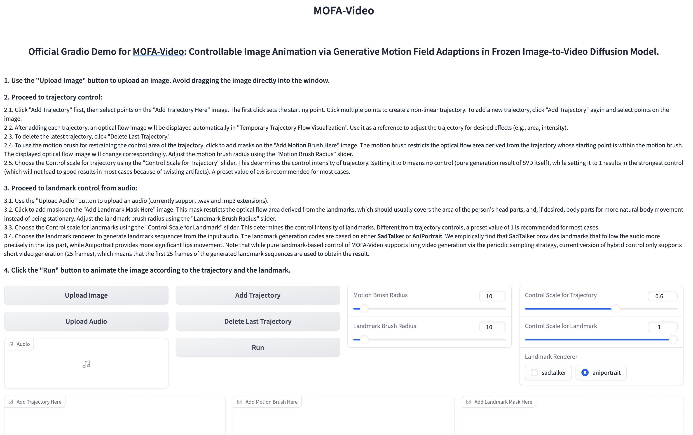
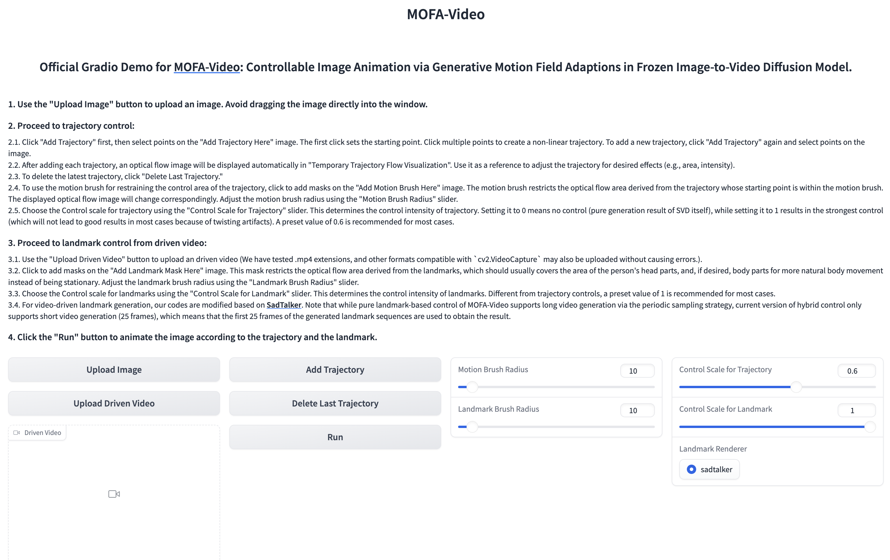

## Introduction

This repo provides the inference Gradio demo for **Hybrid (Trajectory + Landmark)** Control of MOFA-Video.

## Get Started

### 1. Clone the Repository

```
git clone https://github.com/MyNiuuu/MOFA-Video.git
cd ./MOFA-Video
```


### 2. Environment Setup

The demo has been tested on CUDA version of 11.7.

```
cd ./MOFA-Video-Hybrid
conda create -n mofa python==3.10
conda activate mofa
pip install -r requirements.txt
pip install opencv-python-headless
pip install "git+https://github.com/facebookresearch/pytorch3d.git"
```

**IMPORTANT:** ⚠️⚠️⚠️ Gradio Version of **4.5.0** in the `requirements.txt` should be strictly followed since other versions may cause errors.


#### 3. Downloading Checkpoints

1. Download the checkpoint of CMP from [here](https://huggingface.co/MyNiuuu/MOFA-Video-Hybrid/resolve/main/models/cmp/experiments/semiauto_annot/resnet50_vip%2Bmpii_liteflow/checkpoints/ckpt_iter_42000.pth.tar) and put it into `./MOFA-Video-Hybrid/models/cmp/experiments/semiauto_annot/resnet50_vip+mpii_liteflow/checkpoints`.

2. Download the `ckpts` [folder](https://huggingface.co/MyNiuuu/MOFA-Video-Hybrid/tree/main/ckpts) from the huggingface repo which contains necessary pretrained checkpoints and put it under `./MOFA-Video-Hybrid`. You may use `git lfs` to download the **entire** `ckpts` folder:

    1) Download `git lfs` from https://git-lfs.github.com. It is commonly used for cloning repositories with large model checkpoints on HuggingFace.

        **NOTE:** If you encounter the error `git: 'lfs' is not a git command` on Linux, you can try [this solution](https://github.com/text2cinemagraph/text2cinemagraph/issues/1) that has worked well for my case.
    
    2) Execute `git clone https://huggingface.co/MyNiuuu/MOFA-Video-Hybrid` to download the complete HuggingFace repository, which includes the `ckpts` folder.
    3) Copy or move the `ckpts` folder to the GitHub repository.

    

    Finally, the checkpoints should be orgnized as `./MOFA-Video-Hybrid/ckpt_tree.md`. 


### 4. Run Gradio Demo

#### Using audio to animate the facial part

```
cd ./MOFA-Video-Hybrid
python run_gradio_audio_driven.py
```

🪄🪄🪄 The Gradio Interface is displayed as below. Please refer to the instructions on the gradio interface during the inference process!

<td align="center">
  
</td>

#### Using reference video to animate the facial part

```
cd ./MOFA-Video-Hybrid
python run_gradio_video_driven.py
```

🪄🪄🪄 The Gradio Interface is displayed as below. Please refer to the instructions on the gradio interface during the inference process!

<td align="center">
  
</td>

## Acknowledgements
We use [SadTalker](https://github.com/OpenTalker/SadTalker) and [AniPortrait](https://github.com/Zejun-Yang/AniPortrait) to generate the landmarks in this demo. We sincerely appreciate their code and checkpoint release.

