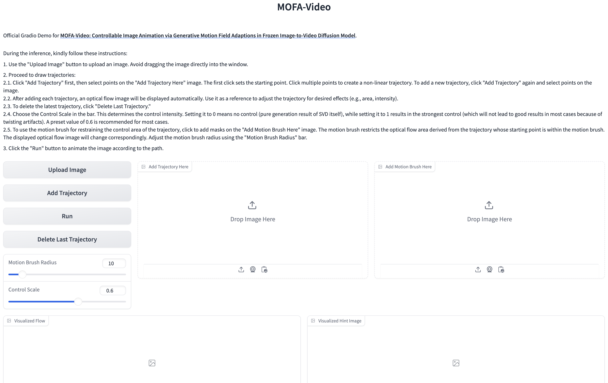

## Updates 🔥🔥🔥

We have released the Gradio demo for **Hybrid (Trajectory + Landmark)** Controls [HERE](https://github.com/MyNiuuu/MOFA-Video/tree/main/MOFA-Video-Hybrid)!

## Environment Setup

`pip install -r requirements.txt`

## Download checkpoints

1. Download the pretrained checkpoints of [SVD_xt](https://huggingface.co/stabilityai/stable-video-diffusion-img2vid-xt-1-1) from huggingface to `./ckpts`.

2. Download the checkpoint of [MOFA-Adapter](https://huggingface.co/MyNiuuu/MOFA-Video-Traj) from huggingface to `./ckpts`.

3. Download the checkpoint of CMP from [here](https://huggingface.co/MyNiuuu/MOFA-Video-Traj/blob/main/models/cmp/experiments/semiauto_annot/resnet50_vip%2Bmpii_liteflow/checkpoints/ckpt_iter_42000.pth.tar) and put it into `./models/cmp/experiments/semiauto_annot/resnet50_vip+mpii_liteflow/checkpoints`.

The final structure of checkpoints should be:


```text
./ckpts/
|-- controlnet
|   |-- config.json
|   `-- diffusion_pytorch_model.safetensors
|-- stable-video-diffusion-img2vid-xt-1-1
|   |-- feature_extractor
|       |-- ...
|   |-- image_encoder
|       |-- ...
|   |-- scheduler
|       |-- ...
|   |-- unet
|       |-- ...
|   |-- vae
|       |-- ...
|   |-- svd_xt_1_1.safetensors
|   `-- model_index.json
```

## Run Gradio Demo

`python run_gradio.py`

🪄🪄🪄 The Gradio Interface is displayed as below. Please refer to the instructions on the gradio interface during the inference process!

<td align="center">
  
</td>
