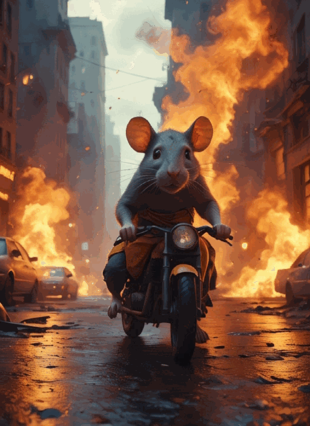
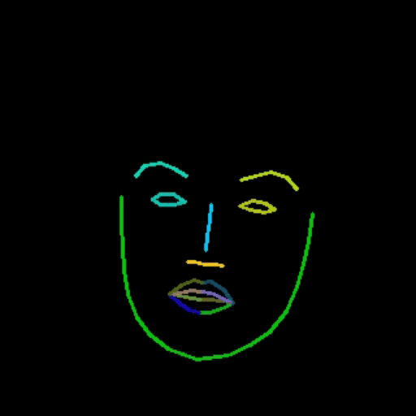

<div align="center">
  <h1>
    🦄️ MOFA-Video: Controllable Image Animation via Generative Motion Field Adaptions in Frozen Image-to-Video Diffusion Model
  </h1>
<a href='https://arxiv.org/abs/2405.20222'></a> &nbsp; <a href='https://myniuuu.github.io/MOFA_Video'></a> &nbsp; <a href='https://huggingface.co/MyNiuuu/MOFA-Video-Traj'></a>
<div>
    <a href='https://myniuuu.github.io/' target='_blank'>Muyao Niu</a> <sup>1,2</sup> &nbsp;
    <a href='https://vinthony.github.io/academic/' target='_blank'>Xiaodong Cun</a><sup>2,*</sup> &nbsp;
    <a href='https://xinntao.github.io/' target='_blank'>Xintao Wang</a><sup>2</sup> &nbsp;
    <a href='https://yzhang2016.github.io/' target='_blank'>Yong Zhang</a><sup>2</sup> &nbsp; <br>
    <a href='https://scholar.google.com/citations?user=4oXBp9UAAAAJ&hl=en' target='_blank'>Ying Shan</a><sup>2</sup> &nbsp;
    <a href='https://scholar.google.com/citations?user=JD-5DKcAAAAJ&hl=en' target='_blank'>Yinqiang Zheng</a><sup>1,*</sup> &nbsp;
</div>
<div>
    <sup>1</sup> The University of Tokyo &nbsp; <sup>2</sup> Tencent AI Lab &nbsp; <sup>*</sup> Corresponding Author &nbsp; 
</div>
</div>


## 🔥🔥🔥 New Features/Updates 

We have released the Gradio inference code and the checkpoints for trajectory-based image animation! Please refer to `./MOFA-Video-Traj/README.md` for instructions.


## 📰 CODE RELEASE
- [x] (2024.05.31) Gradio demo and checkpoints for trajectory-based image animation
- [ ] Training scripts for trajectory-based image animation
- [ ] Inference scripts and checkpoints for keypoint-based facial image animation
- [ ] Training scripts for keypoint-based facial image animation
- [ ] Inference Gradio demo for hybrid image animation


## TL;DR


<div align="center">
  <h3>
    Image 🏞️ + Hybrid Controls 🕹️ = Videos 🎬🍿
  </h3>
</div>


<table align="center">
  <tr>
    <td align="center">
      
      <br />
    </td>
    <td align="center">
      
      <br />
    </td>
    <td align="center">
      
      <br />
    </td>
  </tr>
  <tr>
    <td colspan="3" align="center" style="border: none;">
      Trajectory + Landmark Control
    </td>
  </tr>
</table>

<table align="center">
  <tr>
    <td align="center">
      
      <br />
    </td>
    <td align="center">
      
      <br />
    </td>
    <td align="center">
      
      <br />
    </td>
    <td align="center">
      
      <br />
    </td>
  </tr>
  <tr>
    <td colspan="4" align="center" style="border: none;">
      Trajectory Control
    </td>
  </tr>
</table>


<table align="center">
  <tr>
    <td align="center">
      
      <br />
    </td>
    <td align="center">
      
      <br />
    </td>
    <td align="center">
      
      <br />
    </td>
    <td align="center">
      
      <br />
    </td>
    <td align="center">
      
      <br />
    </td>
    <tr>
    <td colspan="5" align="center" style="border: none;">
      Landmark Control
    </td>
  </tr>
  </tr>
</table>


<div align="center">
Check the gallery of our <a href='https://myniuuu.github.io/MOFA_Video' target='_blank'>project page</a> for more visual results!
</div>


## Introduction

We introduce MOFA-Video, a method designed to adapt motions from different domains to the frozen Video Diffusion Model. By employing <u>sparse-to-dense (S2D) motion generation</u> and <u>flow-based motion adaptation</u>, MOFA-Video can effectively animate a single image using various types of control signals, including trajectories, keypoint sequences, AND their combinations.

<p align="center">
  
</p>

During the training stage, we generate sparse control signals through sparse motion sampling and then train different MOFA-Adapters to generate video via pre-trained SVD. During the inference stage, different MOFA-Adapters can be combined to jointly control the frozen SVD.


## 💫 Trajectory-based Image Animation 

### Inference

Our inference demo is based on Gradio. Please refer to `./MOFA-Video-Traj/README.md` for instructions.


## Citation
```
@article{niu2024mofa,
  title={MOFA-Video: Controllable Image Animation via Generative Motion Field Adaptions in Frozen Image-to-Video Diffusion Model},
  author={Niu, Muyao and Cun, Xiaodong and Wang, Xintao and Zhang, Yong and Shan, Ying and Zheng, Yinqiang},
  journal={arXiv preprint arXiv:2405.20222},
  year={2024}
}
```

## Acknowledgements
We sincerely appreciate the code release of the following projects: [DragNUWA](https://arxiv.org/abs/2308.08089), [SadTalker](https://github.com/OpenTalker/SadTalker), [AniPortrait](https://github.com/Zejun-Yang/AniPortrait), [Diffusers](https://github.com/huggingface/diffusers), [SVD_Xtend](https://github.com/pixeli99/SVD_Xtend), [Conditional-Motion-Propagation](https://github.com/XiaohangZhan/conditional-motion-propagation), and [Unimatch](https://github.com/autonomousvision/unimatch).

