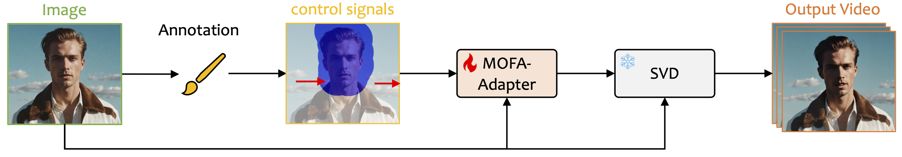

  <h1>
    MOFA-Video: Controllable Image Animation via Generative Motion Field Adaptions in Frozen Image-to-Video Diffusion Model
  </h1>
 &nbsp;  &nbsp; 

    <a href='https://myniuuu.github.io/' target='_blank'>Muyao Niu</a> 1,2 &nbsp;
    <a href='https://vinthony.github.io/academic/' target='_blank'>Xiaodong Cun</a>2,* &nbsp;
    <a href='https://xinntao.github.io/' target='_blank'>Xintao Wang</a>2 &nbsp;
    <a href='https://yzhang2016.github.io/' target='_blank'>Yong Zhang</a>2 &nbsp;  
    <a href='https://scholar.google.com/citations?user=4oXBp9UAAAAJ&hl=en' target='_blank'>Ying Shan</a>2 &nbsp;
    <a href='https://scholar.google.com/citations?user=JD-5DKcAAAAJ&hl=en' target='_blank'>Yinqiang Zheng</a>1 &nbsp;

    1 The University of Tokyo &nbsp; 2 Tencent AI Lab &nbsp; * Corresponding Author &nbsp; 

---

Check the gallery of our <a href='https://myniuuu.github.io/MOFA_Video' target='_blank'>project page</a> for many visual results!

## Introduction

  

We introduce MOFA-Video, a method designed to adapt motions from different domains to the frozen Video Diffusion Model. By employing <u>sparse-to-dense (S2D) motion generation</u> and <u>flow-based motion adaptation</u>, MOFA-Video can effectively animate a single image using various types of control signals, including trajectories, keypoint sequences, AND their combinations.

  

During the training stage, we generate sparse control signals through sparse motion sampling and then train different MOFA-Adapters to generate video via pre-trained SVD. During the inference stage, different MOFA-Adapters can be combined to jointly control the frozen SVD.

## 📰 **TODO**
- [ ] Gradio demo and checkpoints for trajectory-based image animation (By this weekend)
- [ ] Inference scripts and checkpoints for keypoint-based facial image animation
- [ ] inference Gradio demo for hybrid image animation
- [ ] Training codes 

## Acknowledgements
Our Gradio codes are based on the early release of [DragNUWA](https://arxiv.org/abs/2308.08089). Our training codes are based on [Diffusers](https://github.com/huggingface/diffusers) and [SVD_Xtend](https://github.com/pixeli99/SVD_Xtend). We appreciate the code release of these projects.
