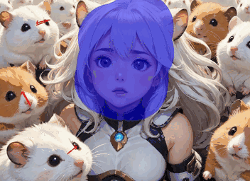
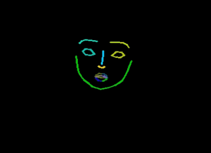
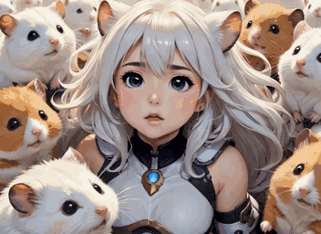
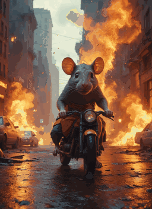
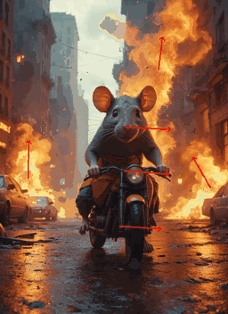
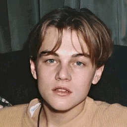
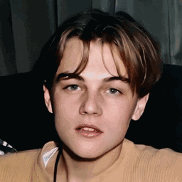
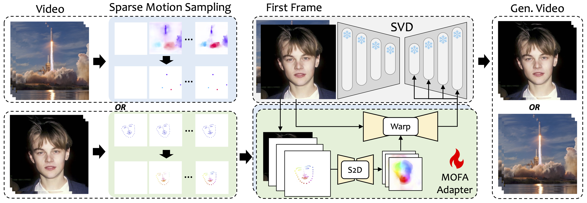

  <h2>🦄️ MOFA-Video: Controllable Image Animation via Generative Motion Field Adaptions in Frozen Image-to-Video Diffusion Model (ECCV 2024) </h2>
<div>
    <a href='https://myniuuu.github.io/' target='_blank'>Muyao Niu</a> <sup>1,2</sup> &nbsp;
    <a href='https://vinthony.github.io/academic/' target='_blank'>Xiaodong Cun</a><sup>2,*</sup> &nbsp;
    <a href='https://xinntao.github.io/' target='_blank'>Xintao Wang</a><sup>2</sup> &nbsp;
    <a href='https://yzhang2016.github.io/' target='_blank'>Yong Zhang</a><sup>2</sup> &nbsp; 
    <a href='https://scholar.google.com/citations?user=4oXBp9UAAAAJ&hl=en' target='_blank'>Ying Shan</a><sup>2</sup> &nbsp;
    <a href='https://scholar.google.com/citations?user=JD-5DKcAAAAJ&hl=en' target='_blank'>Yinqiang Zheng</a><sup>1,*</sup> &nbsp;
</div>
<div>
    <sup>1</sup> The University of Tokyo &nbsp; <sup>2</sup> Tencent AI Lab &nbsp; <sup>*</sup> Corresponding Author &nbsp; 
</div>


In *European Conference on Computer Vision (ECCV) 2024*


<a href='https://arxiv.org/abs/2405.20222'></a> &nbsp; <a href='https://myniuuu.github.io/MOFA_Video'></a> &nbsp; <a href='https://huggingface.co/MyNiuuu/MOFA-Video-Traj'></a> &nbsp; <a href='https://huggingface.co/MyNiuuu/MOFA-Video-Hybrid'></a>


## 🔥🔥🔥 New Features/Updates

- (2024.08.07) We have released the inference script for keypoint-based facial image animation! Please refer to [Here](./MOFA-Video-Keypoint/README.md) for more instructions.

- (2024.07.15) We have released the training code for trajectory-based image animation! Please refer to [Here](./Training/README.md) for more instructions.

- MOFA-Video will be appeared in *ECCV 2024!* 🇮🇹🇮🇹🇮🇹
- We have released the Gradio inference code and the checkpoints for **Hybrid** Controls! Please refer to [Here](./MOFA-Video-Hybrid/README.md) for more instructions. 
- *Free online demo via HuggingFace Spaces will be coming soon!*
- If you find this work interesting, please do not hesitate to give a ⭐!

## 📰 CODE RELEASE
- [x] (2024.05.31) Gradio demo and checkpoints for trajectory-based image animation
- [x] (2024.06.22) Gradio demo and checkpoints for image animation with hybrid control
- [x] (2024.07.15) Training scripts for trajectory-based image animation
- [x] (2024.08.07) Inference scripts and checkpoints for keypoint-based facial image animation
- [ ] Training scripts for keypoint-based facial image animation


## TL;DR


<div align="center">
  <h3>
    Image 🏞️ + Hybrid Controls 🕹️ = Videos 🎬🍿
  </h3>
</div>


<table align="center">
  <tr>
    <td align="center">
      
      <br />
    </td>
    <td align="center">
      
      <br />
    </td>
    <td align="center">
      
      <br />
    </td>
  </tr>
  <tr>
    <td colspan="3" align="center" style="border: none;">
      Trajectory + Landmark Control
    </td>
  </tr>
</table>

<table align="center">
  <tr>
    <td align="center">
      
      <br />
    </td>
    <td align="center">
      
      <br />
    </td>
    <td align="center">
      
      <br />
    </td>
    <td align="center">
      
      <br />
    </td>
  </tr>
  <tr>
    <td colspan="4" align="center" style="border: none;">
      Trajectory Control
    </td>
  </tr>
</table>


<table align="center">
  <tr>
    <td align="center">
      
      <br />
    </td>
    <td align="center">
      
      <br />
    </td>
    <td align="center">
      
      <br />
    </td>
    <td align="center">
      
      <br />
    </td>
    <td align="center">
      
      <br />
    </td>
    <tr>
    <td colspan="5" align="center" style="border: none;">
      Landmark Control
    </td>
  </tr>
  </tr>
</table>


<div align="center">
Check the gallery of our <a href='https://myniuuu.github.io/MOFA_Video' target='_blank'>project page</a> for more visual results!
</div>


## Introduction

We introduce MOFA-Video, a method designed to adapt motions from different domains to the frozen Video Diffusion Model. By employing <u>sparse-to-dense (S2D) motion generation</u> and <u>flow-based motion adaptation</u>, MOFA-Video can effectively animate a single image using various types of control signals, including trajectories, keypoint sequences, AND their combinations.

<p align="center">
  
</p>

During the training stage, we generate sparse control signals through sparse motion sampling and then train different MOFA-Adapters to generate video via pre-trained SVD. During the inference stage, different MOFA-Adapters can be combined to jointly control the frozen SVD.


## 🕹️ Image Animation with Hybrid Controls

#### 1. Clone the Repository

```
git clone https://github.com/MyNiuuu/MOFA-Video.git
cd ./MOFA-Video
```

#### 2. Environment Setup

The demo has been tested on CUDA version of 11.7.

```
cd ./MOFA-Video-Hybrid
conda create -n mofa python==3.10
conda activate mofa
pip install -r requirements.txt
pip install opencv-python-headless
pip install "git+https://github.com/facebookresearch/pytorch3d.git"
```

**IMPORTANT:** ⚠️⚠️⚠️ Gradio Version of **4.5.0** in the `requirements.txt` should be strictly followed since other versions may cause errors.


#### 3. Downloading Checkpoints

1. Download the checkpoint of CMP from [here](https://huggingface.co/MyNiuuu/MOFA-Video-Hybrid/resolve/main/models/cmp/experiments/semiauto_annot/resnet50_vip%2Bmpii_liteflow/checkpoints/ckpt_iter_42000.pth.tar) and put it into `./MOFA-Video-Hybrid/models/cmp/experiments/semiauto_annot/resnet50_vip+mpii_liteflow/checkpoints`.

2. Download the `ckpts` [folder](https://huggingface.co/MyNiuuu/MOFA-Video-Hybrid/tree/main/ckpts) from the huggingface repo which contains necessary pretrained checkpoints and put it under `./MOFA-Video-Hybrid`. You may use `git lfs` to download the **entire** `ckpts` folder:

    1) Download `git lfs` from https://git-lfs.github.com. It is commonly used for cloning repositories with large model checkpoints on HuggingFace.
    2) Execute `git clone https://huggingface.co/MyNiuuu/MOFA-Video-Hybrid` to download the complete HuggingFace repository, which currently only includes the `ckpts` folder.
    3) Copy or move the `ckpts` folder to the GitHub repository.

    **NOTE:** If you encounter the error `git: 'lfs' is not a git command` on Linux, you can try [this solution](https://github.com/text2cinemagraph/text2cinemagraph/issues/1) that has worked well for my case.

    Finally, the checkpoints should be orgnized as `./MOFA-Video-Hybrid/ckpt_tree.md`. 


#### 4. Run Gradio Demo

**Using audio to animate the facial part**

```
cd ./MOFA-Video-Hybrid
python run_gradio_audio_driven.py
```

🪄🪄🪄 The Gradio Interface is displayed as below. Please refer to the instructions on the gradio interface during the inference process!

<td align="center">
  
</td>

**Using reference video to animate the facial part**

```
cd ./MOFA-Video-Hybrid
python run_gradio_video_driven.py
```

🪄🪄🪄 The Gradio Interface is displayed as below. Please refer to the instructions on the gradio interface during the inference process!

<td align="center">
  
</td>


## 💫 Trajectory-based Image Animation 

Please refer to [Here](./MOFA-Video-Traj/README.md) for instructions.


## Training your own MOFA-Adapter

Please refer to [Here](./Training/README.md) for more instructions.


## Citation
```
@article{niu2024mofa,
  title={MOFA-Video: Controllable Image Animation via Generative Motion Field Adaptions in Frozen Image-to-Video Diffusion Model},
  author={Niu, Muyao and Cun, Xiaodong and Wang, Xintao and Zhang, Yong and Shan, Ying and Zheng, Yinqiang},
  journal={arXiv preprint arXiv:2405.20222},
  year={2024}
}
```

## Acknowledgements
We sincerely appreciate the code release of the following projects: [DragNUWA](https://arxiv.org/abs/2308.08089), [SadTalker](https://github.com/OpenTalker/SadTalker), [AniPortrait](https://github.com/Zejun-Yang/AniPortrait), [Diffusers](https://github.com/huggingface/diffusers), [SVD_Xtend](https://github.com/pixeli99/SVD_Xtend), [Conditional-Motion-Propagation](https://github.com/XiaohangZhan/conditional-motion-propagation), and [Unimatch](https://github.com/autonomousvision/unimatch).

